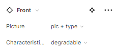
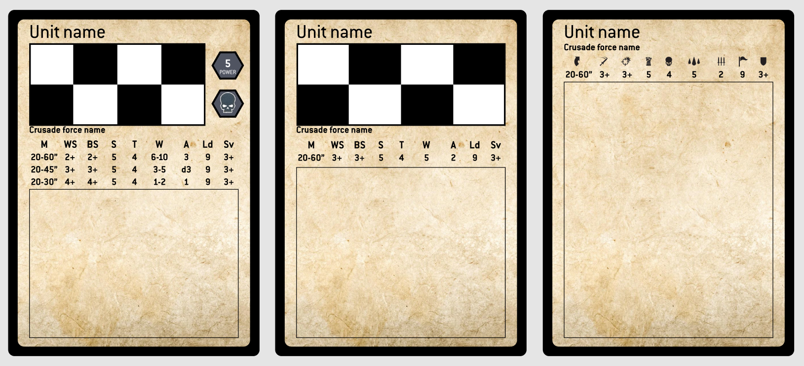
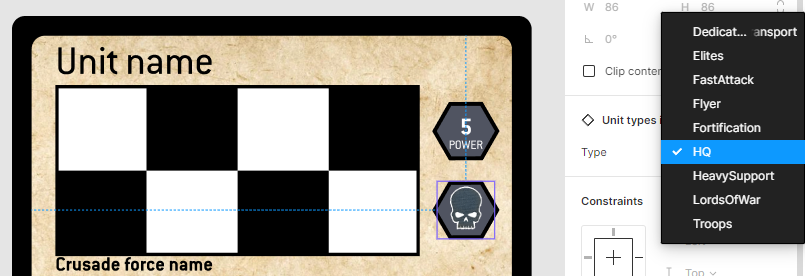
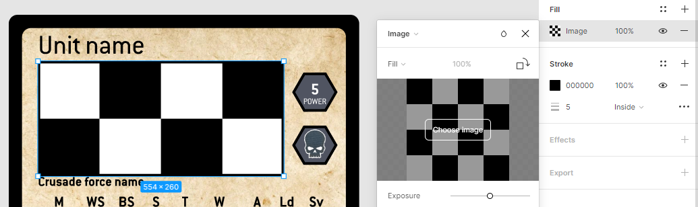
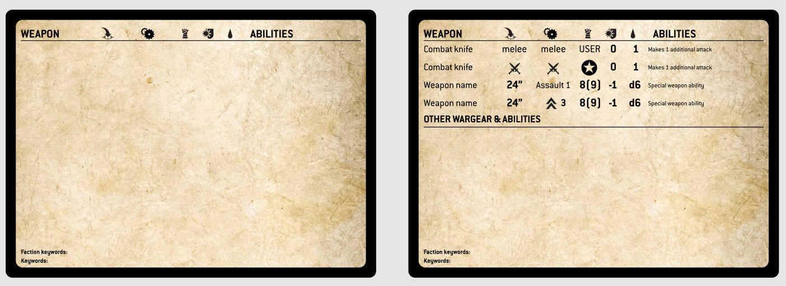

## Кастомные карточки юнитов для WH40k

#### Загружаемые файлы
- [Crusade.fig](Crusade.fig)
- [Шрифт](https://dl.freefontsfamily.com/download/conduit-itc-font/) (Во всех текстовых полях шрифт заменен на наиболее близкий к оригиналу. Потребует дополнительного скачивания и установки в систему бесплатного
  шрифта `ConduitITC`)
- [Мигратор шрифтов для Figma](https://desktop.figma.com/agent/win/InstallFigmaAgent.exe)
    
#### Первые шаги
1. Логинитесь/регистрируетесь на [Figma](https://www.figma.com/)
2. Скачиваете шрифт [`ConduitITC`](https://dl.freefontsfamily.com/download/conduit-itc-font/), устанавливаете в систему (right click -> install)
3. Скачиваете и устанавливаете с официального сайта [мигратор шрифтов](https://desktop.figma.com/agent/win/InstallFigmaAgent.exe) для Figma.
4. В Figma слева наверху жмете плюсик напротив Drafts. Далее Import, выбираете файл **Crusade.fig** Файл импортируется и появится в главной рабочей области. Заходите в него.
5. Открывается главная рабочая область - страница `Print template`. На ней уже отображена область, соответствующая странице формата а4 в 300dpi. 
   Набор своих карточек предлагается делать на этой странице (ну и дублируйте ее, если есть необходимость). Навигация по страницам/шаблонам работает 
   из меню слева вверху. В первой строке бокового меню есть две важные вкладки - `Layers` и `Assets`. Шаблоны располагаются на вкладке `Assets`, а заполнение 
   данными и редактирование на вкладке `Layers`. Чуть ниже есть блок со страницами, в проекте их две - `Print template` и `Assets originals`. **ВАЖНО** - оригиналы 
   шаблонов находятся на странице `Assets originals`. Если вы поменяете что-то в оригинале шаблона - изменение применится ко всем экземплярам этого шаблона 
   на странице `Print template`, так что лучше там ничего не трогать, если не понимаете что делаете.

#### Работа с карточками. 
В шаблонах есть вариант лицевой (общее описание юнита) и оборотной (описание закачек и спец. характеристик) сторон. Размер карточек выбран такой же, как и у карт **МТГ** (3.5 х 2.5 дюйма). 

Переключаетесь на вкладку `Assets`, выбираете шаблон `Base/Front` и перетаскиваете в рабочую область. 
Текстовые поля редактируются по двойному клику. Чтобы выбрать какие-то варианты шаблона в любом добавленном компоненте - выбираете компонент, и справа, 
под блоком `Frame`, будет селект или несколько со всеми возможными вариантами.

**_Пример._** Выделяете кликом только что добавленную картоку `Base/Front`, справа под блоком настроек Frame будет блок с переменными значениями (в данном случае - `Front`, 
по названию корневого компонента). Чуть ниже список параметров и селекты для их значений: 
- **Picture**
  - **no piс** (без картинки)
  - **pic** (с картинкой юнита)
  - **pic + type** (с картинкой, иконкой типа юнита и полем отображения Power)
- **Characteristics**
    - **simple** (один ряд характеристик)
    - **degradable** (три ряда характеристик для деградирующих юнитов)

#### Примеры отображения шаблона лицевой стороны.
Слева направо: 
1. `pic + type` и `degradable` (для вложенного компонента `Service/Unit types icons` выбран вариант `HQ` для отображения соответствующего типа юнита)
2. `pic` и `simple`
3. `no pic` и `simple` (для вложенного компонента Characteristics выбран вариант `icons` для отображения иконками)

* Если кликнуть по таблице характеристик - можно там же выбрать вариант отображения с иконками или с текстом.
* Если выбран шаблон с иконкой юнита - можно кликнуть на нее, и так же справа выбрать любой из типов юнита (пример ниже)
  

* Для добавления картинки дважды кликните по области с "шашками", и справа добавтье необходимую картинку (режим отображения лучше выбрать Crop):

Для добавления обратной стороны выбираете из `Assets` - `Base/Back`.

В базе шаблон содержит только футер с кейвордами и хэдер таблицы варгира (так же с вариантами - иконки или текст). Варгир накиываете из `Assets` - `Wargear/Range` или `Wargear/Melee` (так же 
есть варианты - иконки или текст). Для melee предзаполнены варианты силы: USER, +1, +2, +3, x2 (выбирается справа как описано выше). Тип (assault, rapid etc.) так же 
выбирается справа. Руками заполняете имя пушки, статы S (только для range) Ap D и доп атрибуты.

Далее есть возможность добавить блок описание дополнительного варгира и abilities юнита. Для этого, добавляете разделитель из `Assets` - `Base/Abilities`, и под ним добавляетет текстовые блоки с описанием. 
Для простоты рекомендется на каждый отдельный атрибут/стат добавлять отдельное текстовое поле (hotkey - t). Слева есть фрейм (`Left guide`), к которому удобно для ровности магнитить все добавляемые элементы.

В последнюю очередь заполняются кейворды.
Примеры отображения шаблона задней стороны:

#### Лайфхаки (sic!):
* Чтобы подвинуть/повернуть карточку со всеми добавленными элементами, не являющимися частью шаблона, сначала обведите мышкой всю карточку.
* Для распечатывания `Main menu -> File -> Export frames to PDF`